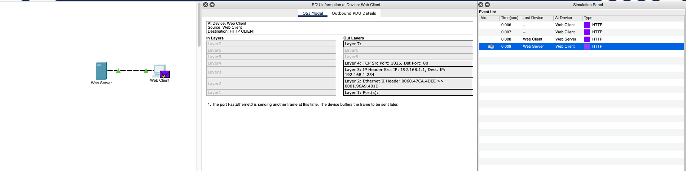

# 3.5.5

## Parte 1

### Paso 3

#### ¿Qué información se indica en los pasos numerados directamente debajo de los cuadros Capas de entrada y Capas de salida?

Las distintas capas - la información que se envía en cada capa. En el primero de los paquetes se muestra solo información sobre la capa de salida, ya que se está enviando la petición al puerto 80 de que se obtenga la información de la página web. En el último paquete solo hay información en entrada.

#### ¿Cuál es el valor del puerto Dst para la capa 4 en la columna Capas de salida?

80

#### ¿Cuál es el destino? ¿ Valor IP para la Capa 3 en la columna Capas de salida ?

192.168.1.254

#### ¿Qué información se muestra en la Capa 2 en la columna Capas de salida?

Ethernet II header 0060.47CA.4DEE >> 0001.96A9.401D

#### ¿Cuál es la información frecuente que se indica en la sección IP de Detalles de PDU comparada con la información que se indica en la ficha Modelo OSI? ¿Con qué capa se relaciona?

Son las direcciones IP de origen y destino. Se relaciona con la información de la capa 3.

#### ¿Cuál es la información frecuente que se indica en la sección TCP de Detalles de PDU comparada con la información que se indica en la ficha Modelo OSI?

Información de los puertos de origen y destino - en el modelo OSI corresponde a la información de la capa 4.

#### ¿Cuál es el host que se indica en la sección HTTP de Detalles de PDU? ¿Con qué capa se relacionaría esta información en la ficha Modelo OSI?

El host sería **/** que se corresponde a la información de la capa 7.

#### Compare la información que se muestra en la columna Capas de entrada con la de la columna Capas de salida: ¿cuáles son las diferencias principales?

Toda la información está revertida - lo que en una es Source en la otra pestaña es Dest.

#### ¿Cuántas fichas se muestran con este evento y por qué? Explique.

Solo hay 2 pestañas ya que este es el momento final y el dispositivo está recibiendo la comunicación final.

## Parte 2

### Paso 1

#### b. ¿Qué tipos de eventos adicionales se muestran?

DNS, ARP y TCP

#### d. ¿Qué información se indica en NOMBRE: en la sección CONSULTA DNS?

Es la URL que pusimos en el navegador del web client.

#### e. ¿En qué dispositivo se capturó la PDU?

En el dispositivo que envió el pedido, el web client.

#### ¿Cuál es el valor que se indica junto a DIRECCIÓN: en la sección RESPUESTA DE DNS de Detalles de la PDU entrante?

La respuesta es la dirección IP 192.168.1.254

#### f. En la lista numerada que está directamente debajo de Capas de entrada y Capas de salida, ¿cuál es la información que se muestra en los elementos 4 y 5?

4. The TCP connection is sucessful
5. The device sets the connection state to ESTABLISHED

#### g. ¿Cuál es el propósito de este evento, según la información proporcionada en el último elemento de la lista (debe ser el elemento 4)?

Parece que el motivo es cerrar la conexión:

`4. The device sets the connection state to CLOSED `

