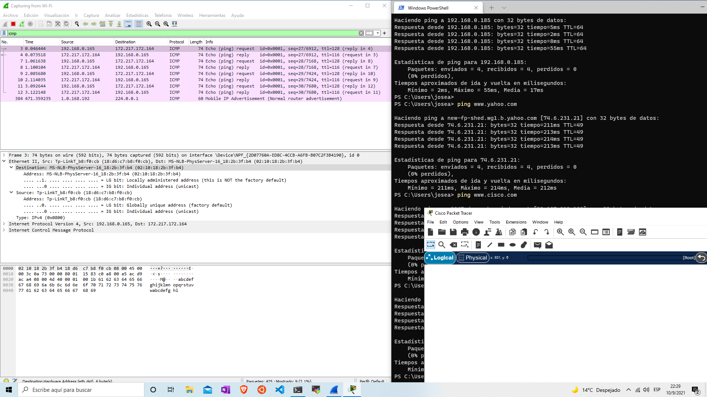

# 3.7.10

## Parte 1

#### ¿La dirección MAC de origen coincide con la interfaz de su PC?

Sí

#### ¿La dirección MAC de destino en Wireshark coincide con la dirección MAC del compañero de equipo?

Sí

#### ¿De qué manera su PC obtiene la dirección MAC de la PC a la que hizo ping?

Las PCs conocen las direcciones MAC de los dispositivos en la misma red.

- Dirección IP de www.yahoo.com: 74.6.231.21
- Dirección MAC para www.yahoo.com: 02:10:18:2b:3f:b4
- Dirección IP para www.cisco.com: 23.197.212.100
- Dirección MAC para www.cisco.com: 02:10:18:2b:3f:b4
- Dirección IP de www.google.com: 172.217.172.164
- Dirección MAC para www.google.com: 02:10:18:2b:3f:b4

#### ¿Qué es importante sobre esta información?

Parece que me está mostrando la dirección MAC del router `MS-NLB-PhyServer-16_`. 

#### ¿En qué se diferencia esta información de la información de ping local que recibió en la parte 1?

En que está usando la dirección MAC del router para salir a internet y encontrar la información.

#### ¿Por qué Wireshark muestra la dirección MAC vigente de los hosts locales, pero no la dirección MAC vigente de los hosts remotos?

Seguramente porque esa información ha sido bloqueada por los administradores de redes, para que un atacante no copie esa dirreción y se haga pasar por esa NIC, por ejemplo.

