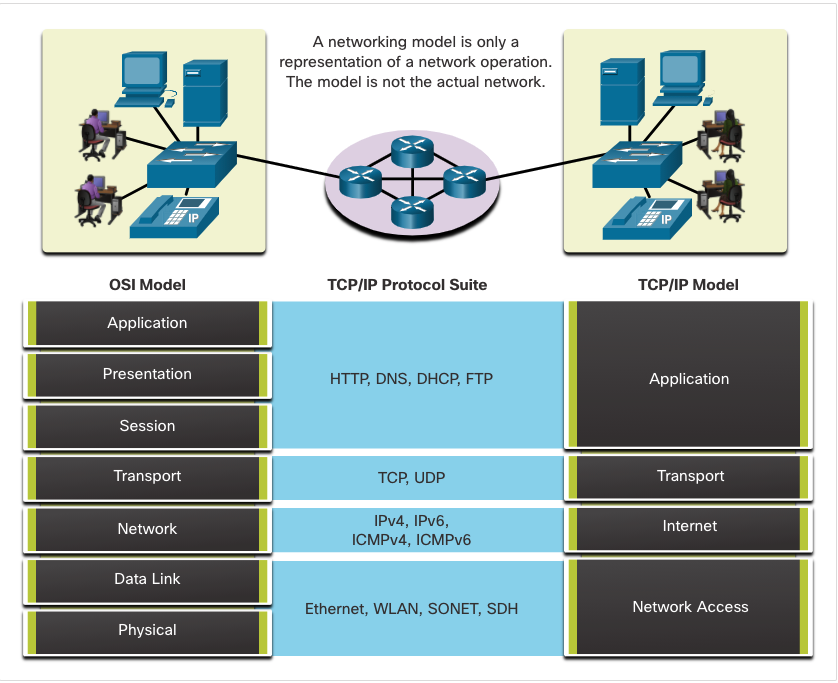

# Unit 3

protocols: the rules that govern how devices communicate.

- physical protocols: ethernet/WLAN
- DHCP/ICMPv6: ip address info, default gateway, DNS server information...
- DNS
- IP (delivery of the packets) and TCP (reliability): webpage, text, image, video, music

the network is a combination of protocols that allow devices to see their place in the network and how to communicate with other devices.

- Unicast - Information is being transmitted to a single end device.
- Multicast - Information is being transmitted to a one or more end devices.
- Broadcast - Information is being transmitted to all end devices.

The multicast animation is indicating the destination devices. By default, a switch will send multicast packets out all ports except the incoming port. However, only the hosts that are part of the multicast group will process the packet.

Network protocols define a common format and set of rules for exchanging messages between devices. Protocols are implemented by end devices and intermediary devices in software, hardware, or both. Each network protocol has its own function, format, and rules for communications. The table lists the functions of these protocols.

| function | description |
| ---- | ----- |
|Addressing	| This identifies the sender and the intended receiver of the message using a defined addressing scheme. Examples of protocols that provide addressing include Ethernet, IPv4, and IPv6. |
|Reliability	| This function provides guaranteed delivery mechanisms in case messages are lost or corrupted in transit. TCP provides guaranteed delivery. |
|Flow control	| This function ensures that data flows at an efficient rate between two communicating devices. TCP provides flow control services. |
|Sequencing	| This function uniquely labels each transmitted segment of data. The receiving device uses the sequencing information to reassemble the information correctly. This is useful if the data segments are lost, delayed or received out-of-order. TCP provides sequencing services. |
|Error Detection | This function is used to determine if data became corrupted during transmission. Various protocols that provide error detection include Ethernet, IPv4, IPv6, and TCP. |
|Application Interface |This function contains information used for process-to-process communications between network applications. For example, when accessing a web page, HTTP or HTTPS protocols are used to communicate between the client and server web processes. |

A message sent over a computer network typically requires the use of several protocols, each one with its own functions and format. From top to bottom

- http: interaction between webserver and web client
- tcp: individual conversations; ensure packages are delivered
- IP: send messages from sender to receiver
- Ethernet: send packages from one nic to another.

A protocol suite is a group of inter-related protocols necessary to perform a communication function.

The lower layers of the stack are concerned with moving data over the network and providing services to the upper layers, which are focused on the content of the message being sent.

## tcp/IP

TCP/IP protocols are available for the **application, transport, and internet layers**. There are no TCP/IP protocols in the network access layer. The most common network access layer LAN protocols are Ethernet and WLAN (wireless LAN) protocols. Network access layer protocols are responsible for delivering the IP packet over the physical medium.

### Application Layer

- Name System
  - DNS - Domain Name System. Translates domain names such as cisco.com, into IP addresses.
- Host Config
  - DHCPv4 - Dynamic Host Configuration Protocol for IPv4. A DHCPv4 server dynamically assigns IPv4 addressing information to DHCPv4 clients at start-up and allows the addresses to be re-used when no longer needed.
  - DHCPv6 - Dynamic Host Configuration Protocol for IPv6. DHCPv6 is similar to DHCPv4. A DHCPv6 server dynamically assigns IPv6 addressing information to DHCPv6 clients at start-up.
  - SLAAC - Stateless Address Autoconfiguration. A method that allows a device to obtain its IPv6 addressing information without using a DHCPv6 server.
- Email
  - SMTP - Simple Mail Transfer Protocol. Enables clients to send email to a mail server and enables servers to send email to other servers.
  - POP3 - Post Office Protocol version 3. Enables clients to retrieve email from a mail server and download the email to the client's local mail application.
  - IMAP - Internet Message Access Protocol. Enables clients to access email stored on a mail server as well as maintaining email on the server.
- File Transfer
  - FTP - File Transfer Protocol. Sets the rules that enable a user on one host to access and transfer files to and from another host over a network. FTP is a reliable, connection-oriented, and acknowledged file delivery protocol.
  - SFTP - SSH File Transfer Protocol. As an extension to Secure Shell (SSH) protocol, SFTP can be used to establish a secure file transfer session in which the file transfer is encrypted. SSH is a method for secure remote login that is typically used for accessing the command line of a device.
  - TFTP - Trivial File Transfer Protocol. A simple, connectionless file transfer protocol with best-effort, unacknowledged file delivery. It uses less overhead than FTP.
- Web and Web Service
  - HTTP - Hypertext Transfer Protocol. A set of rules for exchanging text, graphic images, sound, video, and other multimedia files on the World Wide Web.
  - HTTPS - HTTP Secure. A secure form of HTTP that encrypts the data that is exchanged over the World Wide Web.
  - REST - Representational State Transfer. A web service that uses application programming interfaces (APIs) and HTTP requests to create web applications.

### Transport layer

- Connection-Oriented
  - TCP - Transmission Control Protocol. Enables reliable communication between processes running on separate hosts and provides reliable, acknowledged transmissions that confirm successful delivery.
- Connectionless
  - UDP - User Datagram Protocol. Enables a process running on one host to send packets to a process running on another host. However, UDP does not confirm successful datagram transmission.

### Internet Layer

- Internet Protocol
  - IPv4 - Internet Protocol version 4. Receives message segments from the transport layer, packages messages into packets, and addresses packets for end-to-end delivery over a network. IPv4 uses a 32-bit address.
  - IPv6 - IP version 6. Similar to IPv4 but uses a 128-bit address.
  - NAT - Network Address Translation. Translates IPv4 addresses from a private network into globally unique public IPv4 addresses.
- Messaging
  - ICMPv4 - Internet Control Message Protocol for IPv4. Provides feedback from a destination host to a source host about errors in packet delivery.
  - ICMPv6 - ICMP for IPv6. Similar functionality to ICMPv4 but is used for IPv6 packets.
  - ICMPv6 ND - ICMPv6 Neighbor Discovery. Includes four protocol messages that are used for address resolution and duplicate address detection.
- Routing Protocols
  - OSPF - Open Shortest Path First. Link-state routing protocol that uses a hierarchical design based on areas. OSPF is an open standard interior routing protocol.
  - EIGRP - EIGRP - Enhanced Interior Gateway Routing Protocol. An open standard routing protocol developed by Cisco that uses a composite metric based on bandwidth, delay, load and reliability.
  - BGP - Border Gateway Protocol. An open standard exterior gateway routing protocol used between Internet Service Providers (ISPs). BGP is also commonly used between ISPs and their large private clients to exchange routing information.

### Network Access Layer

- Address Resolution
  - ARP - Address Resolution Protocol. Provides dynamic address mapping between an IPv4 address and a hardware address. Note: You may see other documentation state that ARP operates at the Internet Layer (OSI Layer 3). However, in this course we state that ARP operates at the Network Access layer (OSI Layer 2) because it's primary purpose is the discover the MAC address of the destination. A MAC address is a Layer 2 address.
- Data Link Protocols
  - Ethernet - Defines the rules for wiring and signaling standards of the network access layer.
WLAN - Wireless Local Area Network. Defines the rules for wireless signaling across the 2.4 GHz and 5 GHz radio frequencies.

You cannot actually watch real packets travel across a real network. Complex concepts such as how a network operates can be difficult to explain and understand. For this reason, a layered model is used to modularize the operations of a network into manageable layers.

there are two layered models that are used to describe network operations:

- Open System Interconnection (OSI) Reference Model
- TCP/IP Reference Model

OSI: describing what must be done at a particular layer, but not prescribing how it should be accomplished. It also describes the interaction of each layer with the layers directly above and below.

| OSI Model Layer	|Description |
| ------ | ------ | 
|7 - Application|	The application layer contains protocols used for process-to-process communications. |
|6 - Presentation|	The presentation layer provides for common representation of the data transferred between application layer services. |
|5 - Session	|The session layer provides services to the presentation layer to organize its dialogue and to manage data exchange. |
|4 - Transport|	The transport layer defines services to segment, transfer, and reassemble the data for individual communications between the end devices. |
|3 - Network	|The network layer provides services to exchange the individual pieces of data over the network between identified end devices. |
|2 - Data Link|	The data link layer protocols describe methods for exchanging data frames between devices over a common media | 
|1 - Physical	|The physical layer protocols describe the mechanical, electrical, functional, and procedural means to activate, maintain, and de-activate physical connections for a bit transmission to and from a network device. |

TCP/IP model is sometimes referred to as _the internet model_. The TCP/IP model is a protocol model because it describes the functions that occur at each layer of protocols within the TCP/IP suite.

|TCP/IP Model Layer	| Description |
| ------ | --------|
|4 - Application	| Represents data to the user, plus encoding and dialog control.|
|3 - Transport	| Supports communication between various devices across diverse networks. |
|2 - Internet	| Determines the best path through the network.|
|1 - Network Access	| Controls the hardware devices and media that make up the network. |

_Segmentation_ is the process of dividing a stream of data into smaller units for transmissions over the network. As data moves through the network, it is broken down into smaller pieces and identified so that the pieces can be put back together when they arrive at the destination. Each piece is assigned a specific name (protocol data unit [PDU]) and associated with a specific layer of the TCP/IP and OSI models.

_Multiplexing_: large amounts of data can be sent over the network without tying up a communications link. This allows many different conversations to be interleaved on the network called multiplexing.
